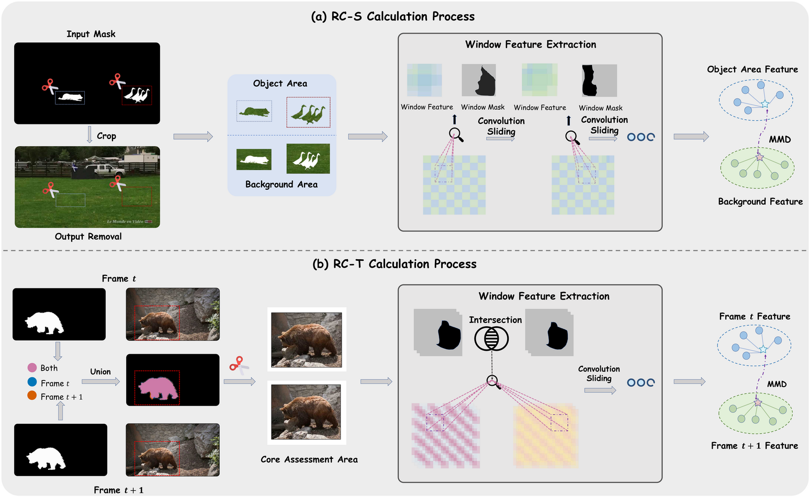

<div align="center">
    <h1>
    PROVE (<b>P</b>erceptual <b>R</b>em<b>OV</b>al coh<b>E</b>rence Benchmark)
    </h1>
    <p>
    Official PyTorch code for <em>PROVE: A Perceptual RemOVal cohErence Benchmark for Visual Media</em><br>    </p>
    </p>
    <a href="https://arxiv.org/abs/2605.14534"></a>
    <a href="https://xiaomi-research.github.io/prove" target='_blank'></a>
    <a href='https://huggingface.co/datasets/HigherHu/PROVE-Bench'></a>
    <a href="https://www.apache.org/licenses/LICENSE-2.0"></a>


If PROVE is helpful to your projects, please help star this repo. Thanks!

</div>


## Overview



**PROVE** is a unified evaluation framework for object removal in images and videos, addressing the critical gap between existing metrics and human perception. It consists of:

- **RC-S** (Removal Coherence - Spatial): Measures how well the inpainted region blends with surrounding background within a single frame via sliding-window MMD on DINOv2 patch features.
- **RC-T** (Removal Coherence - Temporal): Measures temporal coherence of the inpainted region across consecutive frames via distribution tracking within shared restored regions.
- **PROVE-Bench**: A two-tier real-world benchmark comprising **PROVE-M** (80 motion-augmented paired videos with GT) and **PROVE-H** (100 challenging videos without GT).

### Key Findings

| Limitation | Existing Metrics | Our Solution |
|---|---|---|
| Full-Reference Bias | PSNR/SSIM/LPIPS reward copy-paste over genuine erasure | RC-S: no GT required, local region evaluation |
| No-Reference Blind Spots | ReMOVE/CFD favor blurry outputs | RC-S: DINOv2 + MMD robust to blur bias |
| Temporal Insensitivity | TC/TF dominated by unchanged background | RC-T: localized temporal distribution matching |

## Benchmark Results

### PROVE-M (with Ground Truth)

| Method | PSNR↑ | SSIM↑ | LPIPS↓ | ReMOVE↑ | CFD↓ | RC-S↑ | RC-T↓ |
|---|---|---|---|---|---|---|---|
| [FGT](https://github.com/hitachinsk/FGT) | 21.6511 | 0.8619 | 0.2013 | 0.8622 | 0.3229 | 0.3797 | 0.8031 |
| [ProPainter](https://github.com/sczhou/ProPainter) | 22.1846 | 0.8768 | 0.1559 | 0.8676 | **0.2774** | 0.4427 | 0.5951 |
| [DiffuEraser](https://github.com/lixiaowen-xw/DiffuEraser) | 22.0758 | 0.8706 | 0.1518 | 0.8681 | 0.3308 | 0.4787 | 0.4851 |
| [VACE (1.3B)](https://github.com/ali-vilab/VACE) | 20.0826 | 0.8654 | 0.1545 | 0.8117 | 0.3283 | 0.4036 | 0.5217 |
| [Minimax-Remover (1.3B)](https://github.com/zibojia/MiniMax-Remover) | 21.7476 | 0.8707 | 0.1542 | 0.8710 | 0.3202 | 0.4793 | 0.4485 |
| [GenOmni (CogV5B)](https://github.com/gen-omnimatte/gen-omnimatte-public) | 25.0165 | 0.9030 | 0.1223 | 0.8755 | 0.3842 | 0.5029 | 0.3145 |
| [GenOmni (Wan1.3B)](https://github.com/gen-omnimatte/gen-omnimatte-public) | 25.1480 | 0.9017 | 0.1109 | 0.8815 | 0.3457 | 0.5188 | 0.3238 |
| [ROSE (1.3B)](https://github.com/Kunbyte-AI/ROSE) | 26.1333 | 0.9003 | 0.1212 | 0.8803 | 0.3364 | 0.4924 | 0.6538 |
| [EffectErase (1.3B)](https://github.com/FudanCVL/EffectErase) | 27.0049 | 0.9098 | 0.1142 | **0.8841** | 0.3412 | **0.5270** | **0.2728** |
| [UnderEraser (14B)](https://github.com/WeChatCV/UnderEraser) | **28.3325** | <u>0.9156</u> | <u>0.0981</u> | 0.8824 | 0.2986 | 0.5188 | 0.3276 |
| [SVOR (1.3B)](https://github.com/xiaomi-research/svor) | <u>27.4289</u> | **0.9239** | **0.0839** | <u>0.8836</u> | <u>0.2794</u> | <u>0.5236</u> | <u>0.2987</u> |

### PROVE-H (without Ground Truth)

| Method | PSNR↑ | SSIM↑ | LPIPS↓ | ReMOVE↑ | CFD↓ | RC-S↑ | RC-T↓ |
|---|---|---|---|---|---|---|---|
| [FGT](https://github.com/hitachinsk/FGT) | 29.4448 | 0.8615 | 0.1927 | 0.8474 | <u>0.3065</u> | 0.3716 | 0.5866 |
| [ProPainter](https://github.com/sczhou/ProPainter) | **33.3531** | **0.9274** | 0.1063 | 0.8383 | **0.2830** | 0.3932 | 0.4453 |
| [DiffuEraser](https://github.com/lixiaowen-xw/DiffuEraser) | <u>31.4112</u> | <u>0.9178</u> | 0.1098 | 0.8440 | 0.3165 | 0.4387 | 0.3911 |
| [VACE (1.3B)](https://github.com/ali-vilab/VACE) | 26.7266 | 0.8898 | 0.1071 | 0.8047 | 0.3288 | 0.4192 | 0.3438 |
| [Minimax-Remover (1.3B)](https://github.com/zibojia/MiniMax-Remover) | 29.6021 | 0.8660 | 0.1315 | 0.8545 | 0.3320 | 0.4617 | 0.3277 |
| [GenOmni (CogV5B)](https://github.com/gen-omnimatte/gen-omnimatte-public) | 28.7643 | 0.8873 | 0.1183 | 0.8536 | 0.3516 | 0.5006 | **0.2141** |
| [GenOmni (Wan1.3B)](https://github.com/gen-omnimatte/gen-omnimatte-public) | 29.3140 | 0.8940 | **0.1027** | **0.8596** | 0.3422 | <u>0.5127</u> | 0.2368 |
| [ROSE (1.3B)](https://github.com/Kunbyte-AI/ROSE) | 27.6261 | 0.8508 | 0.1402 | 0.8538 | 0.3361 | 0.4687 | 0.4373 |
| [EffectErase (1.3B)](https://github.com/FudanCVL/EffectErase) | 24.3793 | 0.8156 | 0.1742 | 0.8532 | 0.3590 | 0.5081 | <u>0.2363</u> |
| [UnderEraser (14B)](https://github.com/WeChatCV/UnderEraser) | 27.4989 | 0.8485 | 0.1434 | 0.8560 | 0.3165 | 0.5075 | 0.2688 |
| [SVOR (1.3B)](https://github.com/xiaomi-research/svor) | 27.5335 | 0.8907 | <u>0.1046</u> | <u>0.8574</u> | 0.3107 | **0.5166** | 0.2419 |

### Overall (PROVE-M + PROVE-H combined)

Results computed over all cases from both PROVE-M and PROVE-H together. Only no-reference metrics are reported.

| Method | ReMOVE↑ | CFD↓ | RC-S↑ | RC-T↓ |
|---|---|---|---|---|
| [FGT](https://github.com/hitachinsk/FGT) | 0.8540 | 0.3138 | 0.3752 | 0.6828 |
| [ProPainter](https://github.com/sczhou/ProPainter) | 0.8513 | **0.2805** | 0.4152 | 0.5119 |
| [DiffuEraser](https://github.com/lixiaowen-xw/DiffuEraser) | 0.8547 | 0.3229 | 0.4565 | 0.4329 |
| [VACE (1.3B)](https://github.com/ali-vilab/VACE) | 0.8078 | 0.3286 | 0.4123 | 0.4229 |
| [Minimax-Remover (1.3B)](https://github.com/zibojia/MiniMax-Remover) | 0.8618 | 0.3268 | 0.4695 | 0.3814 |
| [GenOmni (CogV5B)](https://github.com/gen-omnimatte/gen-omnimatte-public) | 0.8633 | 0.3661 | 0.5016 | <u>0.2587</u> |
| [GenOmni (Wan1.3B)](https://github.com/gen-omnimatte/gen-omnimatte-public) | **0.8693** | 0.3438 | 0.5154 | 0.2755 |
| [ROSE (1.3B)](https://github.com/Kunbyte-AI/ROSE) | 0.8656 | 0.3362 | 0.4792 | 0.5335 |
| [EffectErase (1.3B)](https://github.com/FudanCVL/EffectErase) | 0.8669 | 0.3511 | <u>0.5165</u> | **0.2525** |
| [UnderEraser (14B)](https://github.com/WeChatCV/UnderEraser) | 0.8677 | 0.3085 | 0.5125 | 0.2949 |
| [SVOR (1.3B)](https://github.com/xiaomi-research/svor) | <u>0.8690</u> | <u>0.2968</u> | **0.5197** | 0.2671 |

> **Note:** Due to compliance requirements, the open-source data differs slightly from the data used in the paper. The results above are based on the open-source version and may exhibit minor numerical differences from the paper, but the overall trends remain consistent.

## Prerequisites

1. Python environment (Python 3.10+)

```
    pytorch 2.6+
    transformers 4.51+
    opencv-python
    numpy
    scikit-image
    pandas
    tqdm
```

2. Pretrained Models:

- Download [DINOv2-giant](https://huggingface.co/facebook/dinov2-giant) and update the `DINO_PATH` in `run_prove_metrics.py`.

3. Dataset Configuration:

- Download the PROVE-Bench dataset from [HuggingFace](https://huggingface.co/datasets/HigherHu/PROVE-Bench).
- Update datasets in `utils/dataset.py` as per your dataset setup.

```python
DATASET = {
    # Video datasets
    "PROVE-M": {
        "inputs": "/PATH/TO/RAW_VIDEOS",
        "masks":  "/PATH/TO/MASKS",
        "type":   "video"
    },
    "PROVE-H": {
        "inputs": "/PATH/TO/RAW_VIDEOS",
        "masks":  "/PATH/TO/MASKS",
        "type":   "video"
    },
    # Image dataset
    "rord": {
        "inputs": "/PATH/TO/RAW_IMAGES",
        "masks":  "/PATH/TO/MASKS",
        "type":   "image"
    }
}
```

**Attention:**
- Generated results must share the same filenames as the originals (extensions may differ).
- Masks are required for both metrics. White regions indicate the removed object.


## File Structure

```
PROVE/
├── run_prove_metrics.py       # Main evaluation script
├── README.md
└── utils/
    ├── __init__.py
    ├── dataset.py             # Dataset configuration
    ├── media_utils.py         # Video/image I/O and pairing
    ├── metrics.py             # RC-S and RC-T implementations
    ├── bbox.py                # Bounding box utilities
    └── predictors.py          # DINOv2 feature predictor
```

## Usage

### Video Evaluation (RC-S + RC-T)

```bash
python run_prove_metrics.py \
    --dataset PROVE-M \
    --result_dir /PATH/TO/GENERATED_VIDEOS \
    --metrics rc_s rc_t \
    --out_csv results.csv
```

### Image Evaluation (RC-S only)

```bash
python run_prove_metrics.py \
    --dataset rord \
    --result_dir /PATH/TO/GENERATED_IMAGES \
    --metrics rc_s \
    --out_csv results.csv
```

> **Note:** RC-T is only applicable to video datasets and will be automatically skipped for image datasets.

### Arguments

| Argument | Description | Default |
|---|---|---|
| `--dataset` | Dataset name (`PROVE-M`, `PROVE-H`, `rord`) | *required* |
| `--result_dir` | Directory containing generated results | *required* |
| `--metrics` | Metrics to compute: `rc_s`, `rc_t` | `rc_s rc_t` |
| `--out_csv` | Output CSV filename | `metrics_prove.csv` |
| `--mask_dir` | Override default mask directory | `None` |
| `--max_items` | Limit number of items to process | `None` |
| `--device` | Compute device | `cuda` |

## Output

The output CSV contains per-item scores and a summary row:

| case_id | rc_s | rc_t | time |
|---|---|---|---|
| video_001.mp4 | 0.1523 | 0.1482 | 12.34 |
| video_002.mp4 | 0.1487 | 0.1501 | 11.87 |
| AVERAGE | 0.1505 | 0.1492 | 12.11 |

- **RC-S**: higher is better (smaller discrepancy between inpainted region and background).
- **RC-T**: lower is better (higher temporal consistency across frames).

## Acknowledgement

Our work benefits from the following open-source projects:

- [DINOv2](https://github.com/facebookresearch/dinov2)


## Citation

If you find our repo useful for your research, please consider citing our paper:

```bibtex
@article{li2026prove,
   title={PROVE: A Perceptual RemOVal cohErence Benchmark for Visual Media},
   author={Li, Fuhao and You, Shaofeng and Hu, Jiagao and Liu, Yu and Chen, Yuxuan and Wang, Zepeng and Wang, Fei and Zhou, Daiguo and Luan, Jian},
   journal={arXiv preprint arXiv:2605.14534},
   year={2026}
}
```
